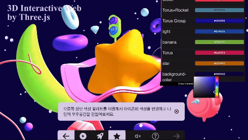

# 프론트엔드 개발자 웹 포트폴리오 | 류혜리
</img>

## 📝 프로젝트 개요 
이 포트폴리오 웹사이트는 프론트엔드 개발자로 취업하기 위한 여정과 기술적 역량을 보여주기 위해 Next.js를 기반으로
개발되었습니다. 기획, 디자인, 개발까지 모든 과정을 직접 수행하였으며, 인터랙티브한 웹 경험을 중점으로 제작하였습니다.  
GSAP의 ScrollTrigger와 Three.js를 활용하여 스크롤에 따라 다양한 애니메이션 효과가 적용되도록 구현하였고,
모바일부터 데스크톱까지 모든 디바이스에서 최적화된 반응형 인터페이스를 제공합니다. 
개발 과정에서 codegrid 유튜브 채널의 다양한 영상을 참조하여 제 방식으로 재해석하였으며,
남들과 차별화된 포트폴리오를 만드는 것이 목표였습니다.

## 🛠️ 기술 스택
Next.js 14 (App Router), CSS Modules, GSAP, Three.js, Swiper, React-Masonry-CSS

## ✨ 주요 기능
### 1. GSAP ScrollTrigger 기반 애니메이션
- 수평 스크롤 갤러리: 프로젝트 섹션에서 수평 스크롤 구현 및 스냅 효과 적용
- 스크롤 연동 애니메이션: 스크롤 위치에 따른 요소 변형 및 애니메이션 타이밍 제어
- 패럴랙스 효과: 스크롤 시 여러 레이어가 다른 속도로 움직이는 깊이감 있는 시각 효과

### 2. Three.js 물결 효과

### 3. 반응형 디자인 적용

## 회고
수평 스크롤 구현
수평 스크롤 섹션을 구현하는 과정에서 다양한 디바이스의 화면 크기에 맞춰 일관된 경험을 제공하는 것이 어려웠습니다. GSAP의 ScrollTrigger를 활용해 문제를 해결했고, 디바이스 크기에 따른 동적 계산을 통해 최적의 경험을 제공할 수 있었습니다.

